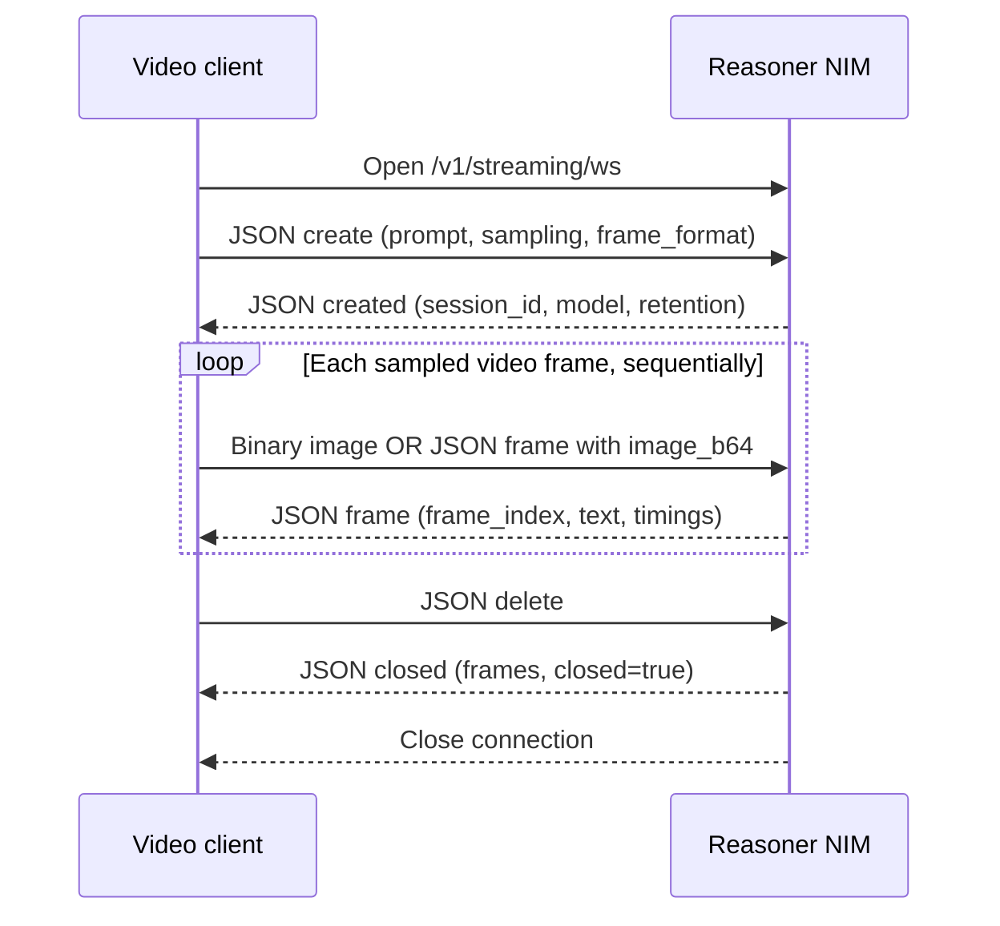

<!-- SPDX-FileCopyrightText: Copyright (c) 2026 NVIDIA CORPORATION & AFFILIATES. All rights reserved.
SPDX-License-Identifier: OpenMDW-1.1 -->

# Stream video frames with the Cosmos3 Reasoner NIM

The streaming API maintains a reasoning session across a sequence of image
frames. Your client decodes or captures the video, sends one JPEG or PNG at a
time, and receives a complete text reply for each frame. The server retains a
bounded history for context and releases older state as the session advances.
It does not accept an MP4 file or a camera URL as a frame.

Use **WebSocket** for a live feed: one connection owns one session, and
disconnecting releases its resources. REST provides the same session behavior
for clients that cannot maintain a WebSocket connection.

[Deploy a Reasoner NIM](deployment.md) with `NIM_ENABLE_STREAMING=true` using
an image with streaming support. See [Streaming video session settings](configuration.md#streaming-video-sessions)
for enablement, capacity, and idle timeouts.

For streaming, n-gram speculative decoding replaces DFlash because DFlash is
currently not supported for streaming.

## Example client

Initialize the [pinned client environment](prerequisites.md#initialize-the-example-environment)
and run commands from `cookbooks/cosmos3/nim`. The
[`streaming.py`](examples/streaming.py) client decodes a local video and sends
sampled frames sequentially over WebSocket (the default) or REST. It checks
the endpoint and discovers the served model before processing the video.

```bash
export NIM_URL=${NIM_URL:-http://localhost:8000}
```

The default input is the existing Reasoner asset
`../reasoner/assets/video_caption.mp4`. Run up to 30 sampled frames:

```bash
uv run python examples/streaming.py --transport websocket --fps 1 --max-frames 30
```

Process the same video through the REST session API:

```bash
uv run python examples/streaming.py --transport rest --fps 1 --max-frames 30
```

Use your own video and JSON/base64 frames with either transport:

```bash
uv run python examples/streaming.py --transport rest \
  --video /path/to/clip.mp4 --fps 2 --frame-format base64
```

Useful options:

| Flag | Use |
| --- | --- |
| `--nim-url` | Override the HTTP(S) base URL from `NIM_URL` |
| `--fps` | Sample the source video at this nominal rate; does not pace requests in wall-clock time |
| `--max-frames` | Stop after this many sampled frames; default 30 |
| `--max-video-segments` | Override retained context; omit to inherit the server policy |
| `--max-tokens` | Bound each reply; client default 48 |
| `--question` | Set the question sent with the first frame |
| `--loop` | Repeat the video until `--max-frames` is reached |
| `--quiet` | Print only every tenth caption |

The client prints per-frame results and does not save artifacts. Both
transports support `--frame-format binary` (raw JPEG bytes) and `base64`
(JSON with `image_b64`).

WebSocket disconnects release the session. REST mode attempts to delete it
after success, an error, or Ctrl+C; it stops on the first error without
retrying frames. REST frame calls have a 1,800-second timeout, and create/delete
calls use 30 seconds. These are client ceilings, not expected latency.

## Endpoints

All paths use the same host and port as the Reasoner API.

| Transport | Path | Result |
| --- | --- | --- |
| `GET` | `/v1/streaming/config` | Model and default retention/sampling configuration |
| WebSocket | `/v1/streaming/ws` | One session per connection |
| `POST` | `/v1/streaming/sessions` | Create a session; HTTP 201 |
| `POST` | `/v1/streaming/sessions/{session_id}/frame` | Submit one frame and wait for its reply; HTTP 200 |
| `DELETE` | `/v1/streaming/sessions/{session_id}` | Close and release a session; HTTP 200 |

WebSocket routes are not described by OpenAPI. The REST endpoints and
WebSocket endpoint share session capacity and admission checks.

### Session configuration

REST creation accepts the following JSON fields. WebSocket creation adds
`"op":"create"` and optionally `"frame_format":"binary"` or `"base64"`.

| Field | Default | Meaning |
| --- | --- | --- |
| `system_prompt` | Required | Task instructions pinned for the entire session |
| `question` | `""` | Optional user question included with the first frame only |
| `fps` | `1.0` | Informational nominal frame rate; does not sample or pace the client |
| `model` | Served model | If specified, must match the model from `/v1/streaming/config` |
| `retention` | Server default | Retained context policy; normally omit it |
| `sampling` | Defaults below | Generation settings applied to every frame reply |

Sampling defaults are `max_tokens: 24`, `temperature: 0.3`, `top_p: 0.9`,
`repetition_penalty: 1.1`, and `frequency_penalty: 0.0`. `max_tokens` bounds
each reply, not the entire session. At most one of `guided_json`,
`guided_choice`, or `guided_regex` may constrain the replies. For example,
`"sampling":{"max_tokens":24,"guided_choice":["clear","hazard"]}`
requests a classification for each frame.

To change the retained frame window for one session, pass, for example,
`"retention":{"max_video_segments":4}`. Inspect the effective `retention`
returned at creation. Larger windows can be refused if they exceed the
engine's individual or shared encoder budget. Advanced retention changes are
also checked against model context and position limits; keep the remaining
defaults unless your workload requires tuning.

The retention object supports these fields:

| Field | Default | Meaning |
| --- | --- | --- |
| `max_video_segments` | Server default when `retention` is omitted | Maximum retained video frames; at least 1 |
| `max_text_tokens` | `null` | Optional soft cap on non-pinned text; when set, must be positive and no greater than `max_session_tokens` |
| `max_session_tokens` | `7000` | Total retained prompt-token budget; required to be non-null and at least 1024 |
| `eviction_policy` | `sliding_window` | Supported policy for removing older context |
| `reprefill_threshold` | `0.7` | Fraction of the trained position range that triggers rebuilding retained context at fresh positions; must be greater than 0 and less than 1 |

A supplied retention object is constructed independently, not merged with the
server's policy. Include `max_video_segments` when overriding retention: if
that field is missing from a supplied object, the underlying policy defaults
to 30, rather than the NIM's default of 8. Omit the entire object to inherit
the server's policy. Admission also requires `max_session_tokens + max_tokens`
to remain below the engine context limit, and `max_session_tokens` to remain
below the re-prefill position threshold.

## REST example: create, send frames, close

Prepare two local image files, `frame1.jpg` and `frame2.jpg`, from your feed.
Run this Bash example with `NIM_URL` set as above. It uses cURL and Python's
standard library and closes the session even if a frame request fails.

```bash
(
  set -euo pipefail
  created=$(curl -fsS "$NIM_URL/v1/streaming/sessions" \
    -H 'Content-Type: application/json' \
    -d '{"system_prompt":"Describe what is happening in each frame in one short sentence.","question":"What is happening in this feed?","fps":1,"sampling":{"max_tokens":48}}')
  session_id=$(printf '%s' "$created" | python3 -c \
    'import json,sys; print(json.load(sys.stdin)["session_id"])')
  trap 'curl -fsS -X DELETE "$NIM_URL/v1/streaming/sessions/$session_id" || true' EXIT
  printf '%s\n' "$created"

  for frame in frame1.jpg frame2.jpg; do
    curl -fsS "$NIM_URL/v1/streaming/sessions/$session_id/frame" \
      -H 'Content-Type: image/jpeg' \
      --data-binary "@$frame" | python3 -m json.tool
  done
)
```

Creation returns `session_id`, `model`, `fps`, and the effective `retention`.
The frame request accepts raw JPEG/PNG bytes; alternatively, send
`Content-Type: application/json` with `{"image_b64":"<raw base64 image>"}`.
Use raw base64 without a data-URL prefix. Wait for each frame response before
sending the next. Deletion returns `session_id`, `frames`, and `closed: true`.

## WebSocket message formats and flow

Connect to `ws://localhost:8000/v1/streaming/ws`, or `wss://` behind TLS.
One connection owns one session. All control messages and every server reply
are JSON **text** messages; only image payloads in binary mode are WebSocket
**binary** messages. Session IDs are returned for identification, but are not
sent with subsequent messages: the connection identifies the session.



Wait for `created` before sending images, and wait for each frame reply before
sending the next image. A reply contains the complete answer for that frame.
The server processes messages sequentially; submitting ahead can queue stale
video frames. Closing the socket instead of sending `delete` also releases
session resources, but the client cannot rely on receiving a final reply.

### Client messages

| Message | Wire format | When to send |
| --- | --- | --- |
| `create` | JSON text with session configuration | First message, exactly once per connection |
| Binary frame | Raw JPEG/PNG bytes, without a JSON envelope | After `created`, when `frame_format` is `binary` |
| `frame` | JSON text with raw base64 in `image_b64` | After `created`, when `frame_format` is `base64` |
| `delete` | JSON text with `op: "delete"` | After the last reply, to close the session explicitly |

**Create.** `system_prompt` is required. All other session fields and sampling
controls are listed in [Session configuration](#session-configuration).
`frame_format` defaults to `binary`. The initial message may omit `op` (the
server defaults it to `create`), but clients should send it explicitly:

```json
{
  "op": "create",
  "frame_format": "binary",
  "system_prompt": "Describe each frame in one short sentence.",
  "question": "What is happening in this feed?",
  "fps": 1.0,
  "retention": {"max_video_segments": 8},
  "sampling": {"max_tokens": 48, "temperature": 0.3, "top_p": 0.9}
}
```

Optionally include `model` from `/v1/streaming/config`. Omit `retention` to use
the complete server default. To change the task prompt, sampling, or frame
format, close the session and create a new one. There is no update, resume,
or application-level ping operation. WebSocket control ping/pong frames are
handled by the WebSocket stack, not by a JSON `op`.

**Binary frame.** Send the JPEG/PNG file bytes as one binary WebSocket message;
there is no `op`, filename, timestamp, session ID, or base64 prefix. Each image
is limited to 8 MiB. The server decodes the image, processes it in the session,
and returns a JSON `frame` reply.

**Base64 frame.** When creation selected `"frame_format":"base64"`, send:

```json
{"op": "frame", "image_b64": "<raw base64 JPEG or PNG>"}
```

Use raw base64, without a `data:image/...;base64,` prefix. Do not switch between
binary and base64 messages within a session. A format mismatch, unknown `op`,
or second `create` produces a recoverable protocol error; it does not update
the session.

**Delete.** The same JSON text message closes either frame format:

```json
{"op": "delete"}
```

### Server messages

| `op` | Fields | Meaning |
| --- | --- | --- |
| `created` | `session_id`, `model`, `fps`, `retention`, `frame_format` | Session accepted; effective retention and negotiated image format |
| `frame` | `frame_index`, `text`, `finish_reason`, `token_count`, timing fields | Completed answer to one image; see [Frame replies](#frame-replies) |
| `closed` | `session_id`, `frames`, `closed` | Session released; `frames` counts answered frames and `closed` is `true` |
| `error` | `message`, `code`, `fatal` | Protocol, admission, or processing error; `code` is HTTP-style, not a WebSocket close code |

For example, creation with the default retention settings returns this shape
(the model and session ID depend on the running service):

```json
{
  "op": "created",
  "session_id": "sess-example",
  "model": "nvidia/cosmos3-nano-reasoner",
  "fps": 1.0,
  "retention": {
    "max_video_segments": 8,
    "max_text_tokens": null,
    "max_session_tokens": 7000,
    "eviction_policy": "sliding_window",
    "reprefill_threshold": 0.7
  },
  "frame_format": "binary"
}
```

A normal explicit close after two answered frames returns:

```json
{"op": "closed", "session_id": "sess-example", "frames": 2, "closed": true}
```

A recoverable error has this shape:

```json
{"op": "error", "message": "unknown op 'update'; expected 'frame' or 'delete'", "code": 400, "fatal": false}
```

With `fatal: false`, correct the message and continue using the session.
With `fatal: true`, stop sending and open a new connection before creating a
new session. Invalid initial messages and admission failures are fatal, as
are missing/dead sessions during frame processing. These close with WebSocket
code `1008`; unexpected internal failures send a fatal `500` error and close
with `1011`. Normal explicit deletion closes with `1000`. Do not assume a
`closed` message will arrive after a fatal error or network disconnect.

## Frame replies

REST returns a JSON object; WebSocket adds `"op":"frame"`. A representative
reply has this shape (text and counts depend on the input):

```json
{
  "op": "frame",
  "frame_index": 0,
  "text": "A person walks through the doorway.",
  "finish_reason": "stop",
  "token_count": 8,
  "ttft_s": null,
  "latency_s": null,
  "decode_ms": null,
  "build_ms": null,
  "engine_ms": null,
  "inqueue_ms": null
}
```

`frame_index` starts at zero. Each reply contains completed text, not a stream
of token deltas. `ttft_s` measures submission to first output text and
`latency_s` measures submission to completion, in seconds. Optional stage
timings report image decoding, prompt construction/preprocessing, engine work,
and queue waiting in milliseconds. Timing fields can be null; they are server
measurements, not client round-trip latency or promised performance.

## Errors and session cleanup

Each frame is limited to **8 MiB** of encoded image bytes (the JPEG/PNG file
bytes, before base64 expansion). Invalid image data is rejected. Both
transports apply the frame-size limit.

REST session errors use
`{"error":{"message":"...","code":400}}` with the corresponding HTTP
status. WebSocket error messages are described [above](#server-messages).

| Code | Meaning and action |
| --- | --- |
| `400` | Invalid configuration, image, or protocol message; correct the request |
| `404` | Unknown model or missing/expired session; verify the model or create a new session |
| `409` | Session busy or no longer usable; serialize REST frame requests, or recreate a dead session |
| `413` | Frame too large; resize or re-encode before sending |
| `503` | Session slots or shared encoder capacity exhausted; close unused sessions or retry creation after capacity becomes available |
| `500` | Server-side failure; inspect service logs and readiness before retrying |

Without the enable flag, the Reasoner does not register the streaming routes.
If routes exist but streaming state is unavailable, handlers can return `501`;
check startup logs, readiness, runtime, and image selection.

Close WebSocket connections or explicitly delete REST sessions when finished.
[Idle timeouts](configuration.md#streaming-video-sessions) are a cleanup
backstop. Expired or disconnected sessions cannot be resumed: create a new
one. Do not resubmit a timed-out frame while its original request may still
be running.
